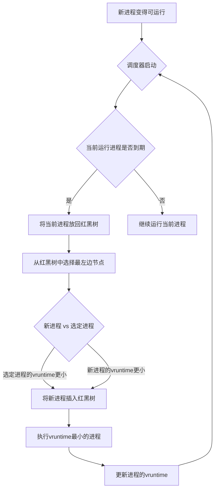

# sched

## 
等待队列与红黑树
- 红黑树中只有已经进入就绪态的任务
- 当任务被挂起时， 会将进程描述符移至等待队列中， 直到重新进入就绪态, 才会被加入红黑树
- 等待队列是内核空间中的一个静态链表

## preempt
- 用户抢占
- 从内核空间返回用户空间时检查need_resched
- 内核抢占
    - 从中断处理返回内核空间时检查need_resched
    - 当进程持有锁的时候是不可被抢占的
    - 当进程释放锁的时候会检查need_resched标志， 若被设置了，则会立马执行调度程序


## CFS
CFS 是如何工作的

现代 Linux 的 CFS（Completely Fair Scheduler）是一种非常精妙的调度器，它不再使用固定的时间片，而是追求“公平”。CFS 的核心思想是确保每个可运行的进程都能获得大致相等的 CPU 运行时间。

CFS 工作的核心基于两个主要概念：

1.  **虚拟运行时（`vruntime`）**：每个进程都有一个 `vruntime` 变量，用来记录它已经运行了多长时间。CFS 总是选择 `vruntime` **最小**的那个进程来运行。
2.  **红黑树（Red-Black Tree）**：CFS 使用红黑树来管理所有可运行的进程。这棵树中的节点就是进程，并以它们的 `vruntime` 作为键值进行排序。由于红黑树是一种自平衡二叉查找树，CFS 总是能以极高的效率（$O(\\log n)$）找到 `vruntime` 最小的进程（也就是树中最左边的叶子节点）。

### CFS 工作流程

我们可以用一个简化的流程图来描述 CFS 的工作过程：



**详细步骤如下：**

1.  **进程就绪**：当一个进程准备好运行（比如，从睡眠中被唤醒或刚被创建）时，它会被插入到红黑树中。为了保证“公平”，新进程的 `vruntime` 会被设置为当前所有进程中最小的 `vruntime`，以确保它能立即获得公平的 CPU 时间。
2.  **选择下一个进程**：调度器总是从红黑树中选择 `vruntime` 最小的那个进程来运行，这个进程就是红黑树最左边的叶子节点。
3.  **运行和更新**：选中的进程开始运行。每隔一段时间（这个时间间隔由调度器动态决定），内核会更新这个进程的 `vruntime`。`vruntime` 的增加速度取决于进程的 **nice 值**（优先级），nice 值越小（优先级越高），`vruntime` 增加得越慢，从而能获得更长的运行时间。
4.  **抢占**：当一个进程运行了一段时间，它的 `vruntime` 超过了红黑树中下一个进程的 `vruntime`，或者有更高优先级的任务变得可运行时，调度器就会触发抢占，将当前进程放回红黑树，并选择新的 `vruntime` 最小的进程。

-----

### CFS 是否依赖于 `ktime`？

**是的，现代 CFS 调度器严重依赖于 `ktime`。**

正如我们前面讨论的，现代 Linux 内核不再依赖固定的时钟节拍（tick）来触发调度。CFS 使用 **高精度定时器** 来精确地测量进程的运行时间，而 `ktime` 就是这个高精度定时器的基准。

CFS 依赖 `ktime` 的主要原因有两个：

1.  **精确测量 `vruntime`**：CFS 需要以极高的精度来更新进程的 `vruntime`。`vruntime` 的计算公式大致为：

    $vruntime\_{new} = vruntime\_{old} + \\Delta t \\times \\frac{nice\_{0}}{weight\_{p}}$

    其中，$\\Delta t$ 是进程实际运行的时间。**`ktime` 提供了纳秒级的精度，能够精确地测量这个 $\\Delta t$**，从而确保 `vruntime` 的更新足够准确，进而保证调度的公平性。

2.  **触发调度事件**：在无节拍模式下，CFS 不依赖周期性的 tick 中断。相反，它会计算出当前进程的“到期时间”（即它应该被抢占的时间点），然后编程一个**高精度定时器**，在那个确切的时间点触发一次中断。这个中断就会唤醒调度器，进行下一次调度。**而这个定时器的时间基准就是 `ktime`。**

### 代码示例

虽然 CFS 的内核代码非常复杂，但我们可以用一个伪代码来展示它的核心逻辑：

```c
// 伪代码，展示CFS的运行逻辑

// 进程描述符，包含vruntime
struct task_struct {
    long long vruntime;
    int nice_value;
    // ... 其他字段
};

// 全局的红黑树
struct rb_root cfs_run_queue;

// 调度器核心函数
void cfs_schedule() {
    // 1. 获取当前正在运行的进程
    struct task_struct* current_task = get_current();

    // 2. 更新当前进程的vruntime
    long long current_run_time = ktime_get_ns() - last_run_start_time; // 使用ktime精确计时
    current_task->vruntime += current_run_time * NICE_0_WEIGHT / current_task->weight;
    
    // 3. 将当前进程放回红黑树
    rb_insert(&cfs_run_queue, current_task);

    // 4. 从红黑树中找到vruntime最小的进程
    struct task_struct* next_task = rb_get_leftmost(&cfs_run_queue);

    // 5. 如果新进程的vruntime更小，或者当前进程时间到期
    if (next_task->vruntime < current_task->vruntime) {
        // 进行上下文切换
        switch_to(next_task);
    }
    
    // 6. 重新编程高精度定时器，以在下一个调度点触发中断
    // ...
}
```

这段伪代码展示了 CFS 如何利用红黑树来管理进程，并使用 `ktime` 来精确地测量进程的运行时间，从而实现其“公平”的调度策略。它完美地体现了现代调度器不再依赖传统 tick 的先进理念。


你的理解非常接近 CFS 的核心思想，但也包含了一些需要澄清的细节。你的问题非常敏锐，它指出了 CFS 调度器一个非常重要的设计点。

---

### vruntime 和 调度机制的澄清

首先，让我们精确地理解几个关键点：

1.  **`vruntime` 的增加**：`vruntime` 确实记录了进程的运行时间，但它并不是从进程创建时就开始不断增加的。**它只在进程实际在 CPU 上运行的时候增加**。当进程被挂起（例如，等待 I/O 或睡眠）时，它的 `vruntime` 是**冻结**的。
2.  **`timeslice` 的概念**：CFS 实际上**没有固定时间片**的概念。CFS 调度器会计算一个**目标调度周期**（`sched_latency_ns`），然后将这个周期**动态地分配**给所有可运行的进程。一个进程获得的“时间片”等于 `目标调度周期 / 可运行进程数`。这个值会根据可运行进程的数量动态变化，因此不是固定的。
3.  **调度触发**：调度器使用高精度定时器来计算下一个调度点，然后设置一个**单次触发**的定时器。当这个定时器到期时，它会触发一次中断，从而唤醒调度器进行上下文切换。在此过程中，`ktime` 被用来精确地测量时间，并更新当前进程的 `vruntime`。

---

### 新进程是否始终比旧进程先运行？

这是一个非常好的问题。如果 CFS 只是简单地将新进程的 `vruntime` 设置为 0，那么它确实会导致新进程总是抢占旧进程，从而导致**饥饿（starvation）**问题，即旧进程永远得不到运行。

为了解决这个问题，CFS 引入了一个非常巧妙的机制：

**新进程的 `vruntime` 会被设置为红黑树中所有进程的最小 `vruntime`。**

我们来详细分析一下你的例子：

假设你有两个进程，`ProcA` 和 `ProcB`，它们的优先级和代码都相同。

1.  **`ProcA` 先启动**：
    * `ProcA` 运行，它的 `vruntime` 从 0 开始增加。
    * 假设 `ProcA` 运行了 100ms。它的 `vruntime` 现在是 `100ms`。

2.  **`ProcB` 启动**：
    * 当 `ProcB` 启动时，调度器会检查红黑树。此时，红黑树中唯一的进程是 `ProcA`，它的 `vruntime` 是 `100ms`。
    * **CFS 调度器不会将 `ProcB` 的 `vruntime` 设置为 0。** 它会将 `ProcB` 的 `vruntime` 设置为 `ProcA` 的 `vruntime`，也就是 `100ms`。
    * 这就确保了 `ProcB` 的 `vruntime` 并没有比 `ProcA` 小，从而避免了 `ProcB` 立即抢占 `ProcA`。

3.  **公平运行**：
    * 当 `ProcB` 被插入红黑树时，`ProcA` 和 `ProcB` 的 `vruntime` 都是 `100ms`（或者非常接近）。
    * 调度器会根据算法，轮流运行 `ProcA` 和 `ProcB`，直到它们的 `vruntime` 再次接近相等。

这样，CFS 就保证了**所有可运行进程的 `vruntime` 都在一个很小的范围内波动**。任何一个新进程，只要它进入可运行状态，它的 `vruntime` 就会被“追上”当前最公平的进度，从而得到公平的运行机会。

**结论**：你的担忧是 CFS 调度器设计者已经考虑并解决了的核心问题。通过将新进程的 `vruntime` 设置为当前红黑树中最小的 `vruntime`，CFS 确保了新旧进程之间始终保持公平，避免了新进程无限制地抢占旧进程的情况。


这是一个非常深刻且关键的问题，它直击了CFS调度器设计的核心理念：“完全公平”并非“绝对平均”。您的观察是正确的：当一个进程因等待信号量而长时间睡眠时，它的`vruntime`会远小于CFS红黑树中其他活跃进程的`vruntime`。然而，**CFS调度器有专门的机制来防止这个“欠债”过多的进程在唤醒后长时间霸占CPU，从而饿死其他进程。**

这个机制可以概括为：**“唤醒追赶” (Wake-up Catch-up) 或 “睡眠公平性” (Sleeper Fairness)**。

下面我们来详细拆解这个过程：

### 1. “旧债”并不会全额补偿

如果一个进程睡眠了很长时间，直接将它带着极小的`vruntime`放入红黑树，确实会导致它在接下来的调度周期中获得远超其他进程的运行时间，这显然是不公平的。

为了解决这个问题，当一个睡眠的进程被唤醒并准备重新入队到红黑树时，CFS并不会直接使用它旧的`vruntime`。相反，内核会对其`vruntime`进行一次**校正**或**“追赶”**。

具体的做法是：

* **找到基准点**：调度器会找到当前CFS运行队列（`cfs_rq`）中的最小虚拟时间 `min_vruntime`。这个值代表了当前红黑树中最“靠左”的进程的`vruntime`，也就是当前最应该被调度的进程的虚拟时钟。
* **设置新的vruntime**：唤醒的进程的`vruntime`会被设置为一个基于`min_vruntime`的值。这个值通常会略小于`min_vruntime`，但不会是它睡眠前的那个非常小的值。一个常见的做法是将其设置为 `min_vruntime - delta`，其中`delta`是一个与调度延迟相关的较小值。

通过这个操作，内核实际上是说：“我们知道你睡了很久，应该得到补偿，但为了不饿死其他人，我们不能让你从你离开的地方开始跑。我们会把你放在当前起跑线（`min_vruntime`）的最前面，给你一点优先权，但你不能领先太多。”

这样一来，该进程确实会在唤醒后获得较高的调度优先级（因为它会被放在红黑树的左侧），但它的优势被限制在一个合理的范围内。

### 2. 调度延迟（`sched_latency`）的约束

即使这个被唤醒的进程获得了`vruntime`上的优势，它单次运行的时间也受到调度周期的限制。CFS的目标是在一个可配置的**调度延迟周期**（`sched_latency_ns`，例如默认20ms）内，让所有可运行的进程都至少运行一次。

当这个被唤醒的进程开始执行时，它的`vruntime`会像其他进程一样随着物理时间的流逝而增加。一旦它的`vruntime`超过了红黑树中下一个节点的`vruntime`，并且它已经运行了足够长的时间（通常超过一个最小粒度`sched_min_granularity_ns`），它就可能被抢占。

因此，它不会“一直运行直到补足所有睡眠时间”。它只会在当前以及后续的几个调度周期内比其他进程获得更多的运行机会，直到它的`vruntime`逐渐“追上”队列的平均水平。

### 总结

所以，对于您的问题，答案是：**不会。进程在被信号量挂起很久后重新进入红黑树，不会导致它长时间运行而不被抢占。**

这得益于CFS的两个关键设计：

1.  **Vruntime追赶机制**：在进程唤醒时，将其`vruntime`校正到接近当前队列的最小值，而不是使用其陈旧的、过小的值。这限制了它的“领先优势”。
2.  **调度周期和抢占**：CFS的公平性是周期性体现的。进程的运行受`sched_latency_ns`和`sched_min_granularity_ns`的约束，一旦有其他进程变得更“值得”运行（即`vruntime`更小），抢占就会发生。

这种设计精妙地平衡了**补偿**与**公平**：既补偿了长时间等待的进程，确保了它的响应性，又防止它破坏整个系统的公平性，避免了其他进程的饥饿。这正是CFS“完全公平”调度理念的精髓所在。
